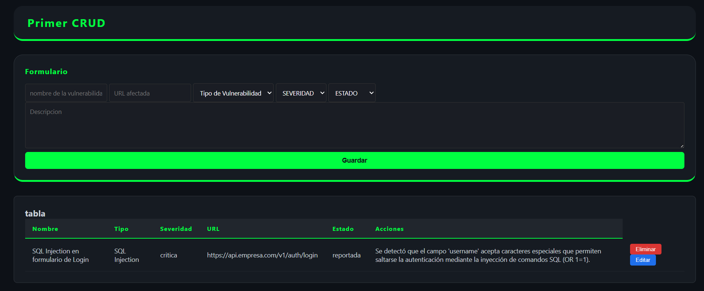

# P-CRUD 🛡️

Sistema de registro y seguimiento de vulnerabilidades web, 
desarrollado como proyecto personal de aprendizaje.

## 🚀 Tecnologías usadas

- 
- 
- 
- 

## ✅ Funcionalidades

- Registrar vulnerabilidades con nombre, tipo, severidad, URL, estado y descripción
- Visualizar todos los registros en una tabla
- Editar registros existentes
- Eliminar registros
- Persistencia de datos con LocalStorage

## 📁 Estructura del proyecto
```text
P-CRUD/
├── Frontend/
│   ├── index.html
│   ├── styles.css
│   └── script.js
└── Backend/
└── servicio.js # (En desarrollo: Próxima implementación de API)
```
## 🖥️ Cómo ejecutarlo

1. Clona el repositorio
2. Abre `index.html` en tu navegador
3. No requiere instalación

## 📌 Próximos pasos

- [ ] Conectar con backend Node.js
- [ ] Persistencia con base de datos MySQL
- [ ] Autenticación de usuarios

## 👨‍💻 Autor

Juan David Villarreal — Estudiante de Ingeniería de Sistemas
